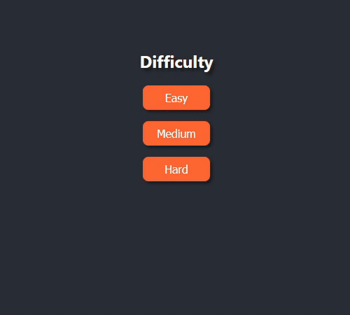

# FairMinesweeper

Tired of losing Minesweeper games on 50-50 random guesses? Suffer no more!

This is a Minesweeper implementation on React, with a very cool feature: whenever you
are forced to make a random guess because you've exhausted all other options (either
opening squares or placing flags), the game guarantees that that random guess will
_always_ be successful. So no more games where the luck of the draw kills you!

If you are a beginner and you are stuck, the game is also equipped with a "get hint"
button that tells you what is the next move you could make, and an explanation of
why this is the case.

To do both of the above, I've implemented a Minesweeper solver that "looks" at a
Minesweeper board and figures out which is the next move you could make. If you want
to look at the details, check [SOLVER.md](./SOLVER.md).

## Installation and running

Requires Node (I recommend version 16). `yarn` is recommended, but not needed.

1. Install dependencies: run `yarn install` or `npm install`.
2. Run the app: `yarn start` or `npm start`.
3. Run unit tests: `yarn test` or `npm run test`.